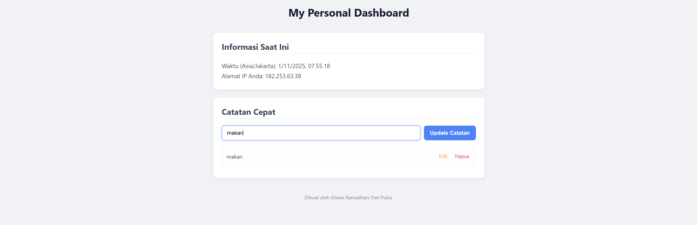

# Tugas Praktikum: Aplikasi Personal Dashboard

Aplikasi ini adalah dashboard personal sederhana yang dibuat untuk memenuhi tugas praktikum "JavaScript Next Gen". Aplikasi ini memungkinkan pengguna untuk mengelola catatan cepat dan menampilkan informasi waktu serta IP pengguna secara real-time.

## 🚀 Fitur Aplikasi

* **Info Asinkron**: Menampilkan waktu (berdasarkan zona waktu IP) dan alamat IP publik pengguna. Data diambil dari API eksternal (`worldtimeapi.org` dan `api.ipify.org`).
* **CRUD Catatan**:
    * **Create**: Menambah catatan baru.
    * **Read**: Menampilkan daftar semua catatan.
    * **Update**: Mengedit catatan yang sudah ada.
    * **Delete**: Menghapus catatan.
* **Penyimpanan Lokal**: Semua catatan disimpan di `localStorage` browser, sehingga data tidak hilang saat halaman di-refresh.

## 📸 Screenshot Aplikasi

## 🛠️ Implementasi Fitur ES6+

Berikut adalah daftar fitur ES6+ yang diwajibkan dan telah diimplementasikan dalam proyek ini:

1.  **`let` dan `const`**:
    * `const` digunakan untuk mendeklarasikan elemen DOM dan fungsi yang tidak akan di-reassign.
    * `let` digunakan untuk variabel state `notes` yang dapat berubah (ditambah, difilter, atau di-load dari storage).

2.  **Arrow Functions (`=>`)**:
    * Digunakan untuk semua *event listener* (submit form, klik list).
    * Digunakan untuk fungsi utilitas (misalnya `renderNotes`, `saveNotesToStorage`).
    * Digunakan sebagai callback dalam *higher-order functions* seperti `.forEach()`, `.filter()`, dan `.find()`.
    * Fungsi asinkron `fetchInfo` juga didefinisikan sebagai *arrow function*.

3.  **Template Literals (String Backticks `` ` ``)**:
    * Digunakan di fungsi `fetchInfo` untuk menampilkan string dinamis data waktu dan IP.
    * Digunakan di fungsi `renderNotes` untuk membuat elemen `<li>` (HTML string) secara dinamis dari data catatan.

4.  **Fungsi Asinkron (`async/await`)**:
    * Fungsi `fetchInfo` menggunakan `async/await` untuk mengambil data dari dua API berbeda secara non-blocking.
    * `Promise.all` digunakan untuk menjalankan kedua *fetch request* secara paralel untuk efisiensi.
    * Blok `try...catch` digunakan untuk menangani potensi error saat fetching.

5.  **Classes**:
    * Sebuah `class Note` dibuat untuk menjadi *blueprint* objek catatan.
    * Setiap catatan baru dibuat menggunakan `new Note(id, content)`, yang meningkatkan keterbacaan dan struktur data.

6.  **(Bonus) Array Methods Modern / Higher-Order Functions**:
    * `notes.forEach()`: Digunakan di `renderNotes` untuk iterasi dan menampilkan setiap catatan.
    * `notes.filter()`: Digunakan di fitur *delete* untuk membuat array baru tanpa catatan yang dihapus.
    * `notes.find()`: Digunakan di fitur *edit* untuk mencari catatan spesifik yang akan di-update.