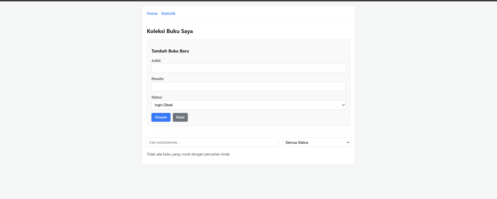
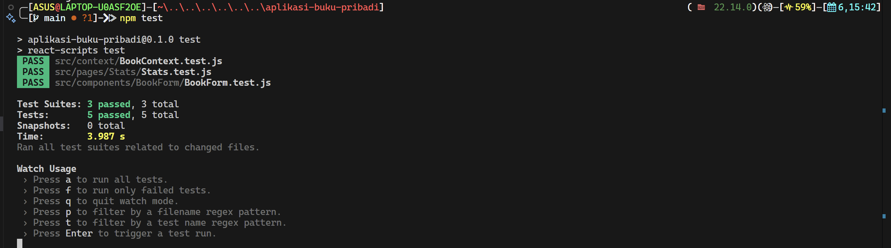

# 📚 Aplikasi Manajemen Buku Pribadi

Ini adalah proyek untuk praktikum Pemrograman Web, dibuat menggunakan React. Aplikasi ini memungkinkan pengguna untuk mencatat dan mengelola koleksi buku pribadi mereka.

---

## 📸 Screenshot Antarmuka



## 📸 Screenshot Hasil Testing


---

## 📋 Deskripsi Aplikasi

Aplikasi ini adalah *Single Page Application* (SPA) yang memungkinkan pengguna untuk:
* **Mencatat buku:** Menambah, mengedit, dan menghapus data buku.
* **Mengelola status:** Melacak status buku (Ingin Dibeli, Sedang Dibaca, Sudah Dimiliki).
* **Mencari & Menyaring:** Menemukan buku dengan cepat berdasarkan judul/penulis atau memfilter berdasarkan status.
* **Melihat Statistik:** Melihat ringkasan jumlah total buku berdasarkan statusnya.

Data disimpan di `localStorage` browser sehingga tidak hilang saat halaman di-refresh.

---

## ⚙️ Instruksi Instalasi dan Menjalankan

### 1. Instalasi
Pastikan Node.js terinstal. Clone repository ini dan jalankan:
```bash
npm install
```
### 2. Instalasi
Untuk menjalankan aplikasi di http://localhost:3000:
```bash
npm start
```
### 3. Menjalankan Testing
Untuk menjalankan 5 unit test yang telah dibuat:
```bash
npm test
```